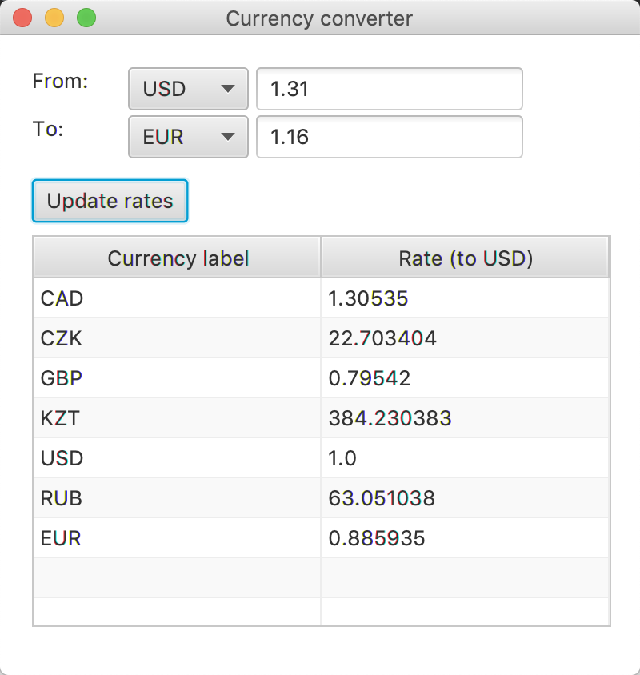

## A simple currency converter with a friendly UI based on scalafx

### Purposes:
1. Learn Scala
2. Understand a build system
3. Make something more or less useful

### UI:

### Run:

It connects to **www.currencyconverterapi.com** and get rates for several currencies.
To work with actual rates (not with dumped ones) you need to create **settings.ini** alongside with **src** folder.
It should contain only one line with your API KEY.
